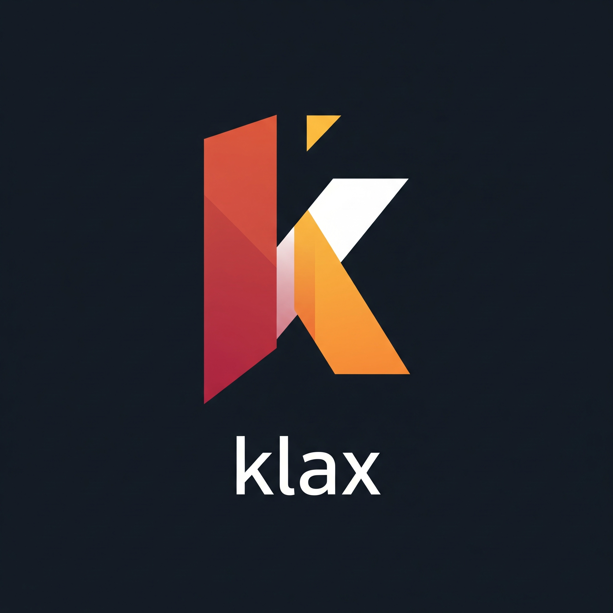

<div align="center">

</div>

A lightweight machine learning package for computational mechanics built on JAX.

---

Check out the [Documentation](https://drenderer.github.io/klax/) for examples and reference material.

## What is Klax?

Klax provides specialized machine learning architectures, constraints, and training utilities for mechanics and physics applications. Built on top of [JAX](https://docs.jax.dev/en/latest/), [Equinox](https://docs.kidger.site/equinox/), and [Optax](https://optax.readthedocs.io/en/latest/), it offers:

- **Special Neural Networks**: Implementations of, e.g.,  Input Convex Neural Networks (ICNNs), matrix-valued neural networks, MLPs with custom initialization, and more.
- **JAX Compatibility**: Seamless integration with JAX's automatic differentiation and acceleration.
- **Parameter Constraints**: Differentiable and non-differentiable parameter constraints through [`klax.Unwrappable`](https://drenderer.github.io/klax/api/wrappers/#klax.Unwrappable) and [`klax.Constraint`](https://drenderer.github.io/klax/api/wrappers/#klax.Constraint)
- **Customizable Training**: Methods and APIs for customized calibrations on arbitrary PyTree data structures through [`klax.fit`](https://drenderer.github.io/klax/api/training/#klax.fit), [`klax.Loss`](https://drenderer.github.io/klax/api/losses/#klax.Loss), and [`klax.Callback`](https://drenderer.github.io/klax/api/callbacks/#klax.Callback).

Klax is designed to be minimally intrusive - all models inherit directly from [`equinox.Module`](https://docs.kidger.site/equinox/api/module/module/#equinox.Module) without additional abstraction layers. This ensures full compatibility with the JAX/Equinox ecosystem.

The constraint system is derived from Paramax's [`paramax.AbstractUnwrappable`](https://danielward27.github.io/paramax/api/wrappers.html#paramax.wrappers.AbstractUnwrappable), extending it to support non-differentiable/zero-gradient parameter constraints such as ReLU-based non-negativity constraints.

The provided calibration utilities ([`klax.fit`](https://drenderer.github.io/klax/api/training/#klax.fit), [`klax.Loss`](https://drenderer.github.io/klax/api/losses/#klax.Loss), [`klax.Callback`](https://drenderer.github.io/klax/api/callbacks/#klax.Callback)) are designed to operate on arbitrarily shaped PyTrees of data, fully utilizing the flexibility of JAX and Equinox. While they cover most common machine learning use cases, as well as our specialized requirements, they remain entirely optional. The core building blocks of Klax work seamlessly in custom training loops.

Currently Klax's training utilities are built around Optax, but different optimization libraries could be supported in the future if desired.

If you like using Klax, feel free to leave a GitHub star and create a PR if there is a feature that you think could benefit others too.

## Installation

Klax can be installed via pip using

```bash
pip install klax
```

If you want to add the latest release of klax to your Python project run

```bash
uv add klax
```

**or** get the most recent changes from the main branch via

```bash
uv add "klax @ git+https://github.com/Drenderer/klax.git@main"
```


## Development

The developers of klax use uv for managing dependencies and virtual environments. To setup the development environment with all required, optional, and development dependences simply clone the repository and run 

```bash
uv sync --all-extras --all-groups
```

from the project root. This will create a virtual environment with all the rependencies required for development and [install klax in editable mode](https://docs.astral.sh/uv/concepts/projects/config/#editable-mode).

### Building the docs

To preview the documentation locally, run

```bash
uv run mkdocs serve
```

To build the static site, run

```bash
uv run mkdocs build
```

### Updating pyproject.toml versions

Every once in a while it can make sense to update the minimal required versions specified in `pyproject.toml`. To update the minimal Python version to a `[TARGET]` version run

```bash
uv python install [TARGET]
uv python pin [TARGET]
```

To update the minimal dependency versions and to sync the virtual environment accordingly run

```bash
uv lock --upgrade
uv sync
```

For more information on uv, visit the [uv documentation](https://docs.astral.sh/uv/). Note, that klax does not add `.python-version` and `uv.lock` files to VCS, as it is generally not recommended for libraries. See [this](https://stackoverflow.com/questions/61037557/should-i-commit-lock-file-changes-separately-what-should-i-write-for-the-commi) discussion on Stack Overflow for reference.


### Setting up pre-commit

First make sure pre-commit is installed
```bash
uv sync --all-extras --all-groups
```

Then install the git hook scripts
```bash
pre-commit install
```

(optional) Run against all the files. It's usually a good idea to run the hooks against all of the files when adding new hooks (usually pre-commit will only run on the changed files during git hooks)
```bash
pre-commit run --all-files
```

## Related
