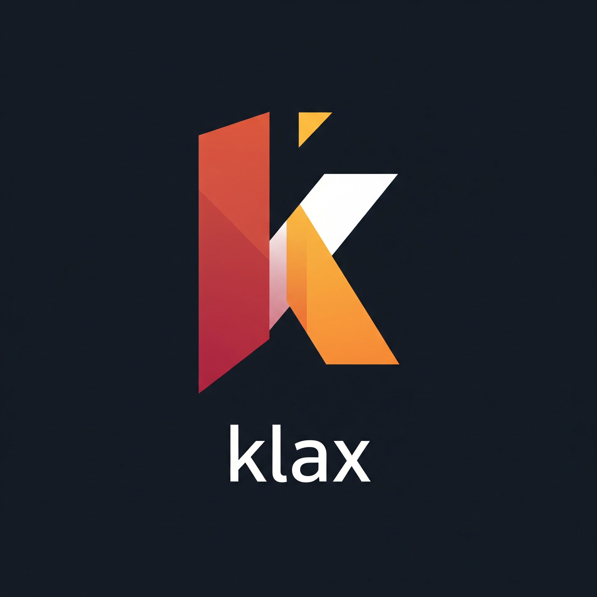

<div align="center">

</div>

A lightweight machine learning package for computational mechanics built on JAX.

---

Check out the [Documentation](https://drenderer.github.io/klax/) for examples and reference material.


## What is Klax?

Klax provides:

- **Specialized machine learning architectures**: [MLPs][klax.nn.MLP] with customizable initialization, [fully][klax.nn.FICNN] and [partially][klax.nn.PICNN] input convex neural networks (ICNNs), matrix-valued neural networks, e.g., [skew symmetric][klax.nn.SkewSymmetricMatrix] matrices, and more.
- **Parameter constraints**: Differentiable and non-differentiable parameter constraints, e.g., [non-negativity][klax.NonNegative] and [symmetry][klax.Symmetric] constraints.
- **Highly customizable training and logging utlities**: Methods for [calibrating][klax.fit] abitrary trainable PyTrees with custom [loss functions][klax.Loss], [callbacks][klax.Callback], and [metrics logging][klax.MetricLogger].
- **Full JAX compatibility**: Seamless integration with [JAX](https://docs.jax.dev/en/latest/)'s automatic differentiation and acceleration

Klax is build around the highly successfull [JAX](https://docs.jax.dev/en/latest/), [Equinox](https://docs.kidger.site/equinox/), and [Optax](https://optax.readthedocs.io/en/latest/) projects and designed to be minimally intrusive. All models inherit directly from [`equinox.Module`](https://docs.kidger.site/equinox/api/module/module/#equinox.Module) without additional abstraction layers, ensuring full compatibility with the ecosystem.

The constraint system is derived from Paramax's [`paramax.AbstractUnwrappable`](https://danielward27.github.io/paramax/api/wrappers.html#paramax.wrappers.AbstractUnwrappable), extending it to support non-differentiable/zero-gradient parameter constraints such as ReLU-based non-negativity constraints.

The training utilities ([`klax.fit`][], [`klax.Loss`][], [`klax.Callback`][]) are designed to operate on arbitrarily shaped model and data PyTrees, fully utilizing the flexibility of JAX and Equinox. While they cover most common machine learning use cases, as well as our specialized requirements, they remain entirely optional. The meachine learning architectures implemented in Klax work seamlessly in any JAX-compatible training loop.

Currently Klax's training utilities are built around [Optax](https://optax.readthedocs.io/en/latest/), but different optimization libraries could be supported in the future if desired.

## Support us!

If you like using Klax, feel free to leave a GitHub star, and if there is a machine learning architecture or anything else that you think should be included in Klax, please consider opening a PR.


## Installation

Klax can be installed via pip using

```bash
pip install klax
```

If you want to add the latest release to your Python [uv](https://docs.astral.sh/uv/) project run

```bash
uv add klax
```

or directly install the main branch via

```bash
uv add "klax @ git+https://github.com/Drenderer/klax.git@main"
```
